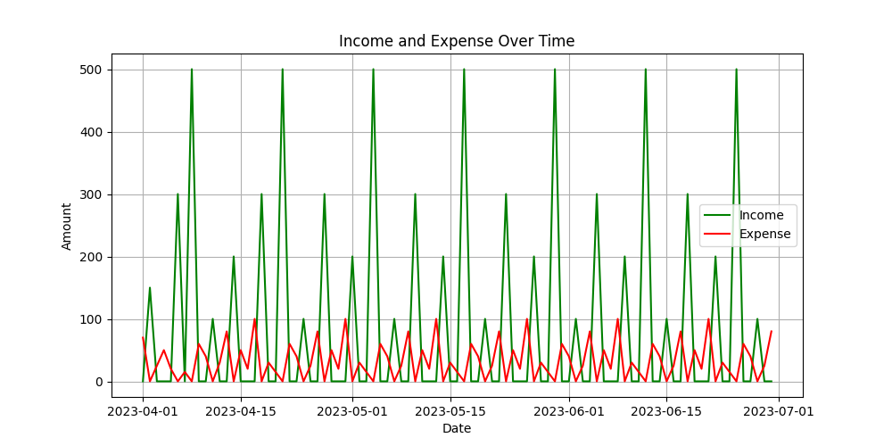

# Personal Finance Tracker

## Overview
This project is a **Personal Finance Tracker** built using Python. It leverages the power of **Pandas** for data manipulation and **Matplotlib** for data visualization. The goal of this tool is to help users track and analyze their financial data effectively.

## Features
- Import and manage financial data using Pandas.
- Generate insightful visualizations with Matplotlib.
- Track income, expenses, and savings over time.
- Identify spending patterns and trends.

## Requirements
- Python 3.7 or higher
- Required libraries:
  - Pandas
  - Matplotlib

Install the dependencies using:
```bash
pip install pandas matplotlib
```

## Usage
1. Clone the repository:
   ```bash
   git clone https://github.com/your-username/personal-finance-tracker.git
   cd personal-finance-tracker
   ```
2. Add your financial data in the required format (e.g., CSV or Excel).
3. Run the script:
   ```bash
   python tracker.py
   ```
4. View the generated reports and visualizations.

## Example
Here’s an example of a spending trend visualization:



## Contributing
Contributions are welcome! Feel free to open issues or submit pull requests.

## License
This project is licensed under the MIT License. See the [LICENSE](LICENSE) file for details.

## Acknowledgments
- [Pandas Documentation](https://pandas.pydata.org/docs/)
- [Matplotlib Documentation](https://matplotlib.org/stable/contents.html)

Happy tracking!